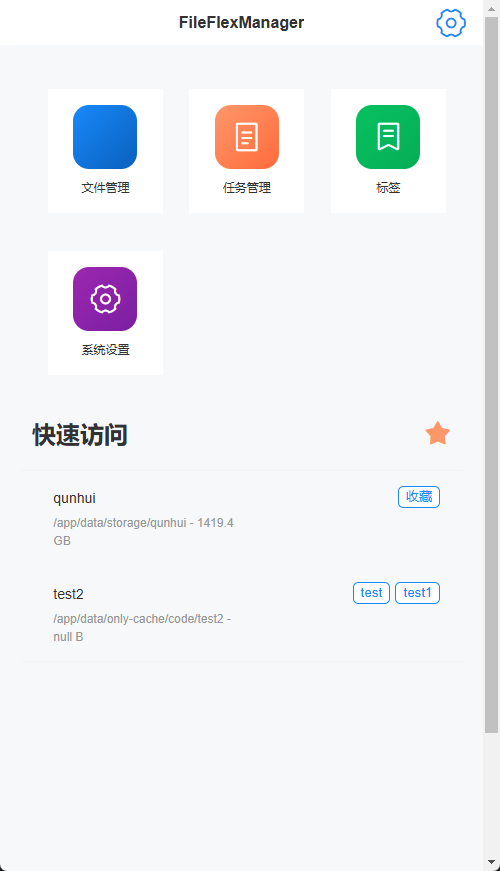
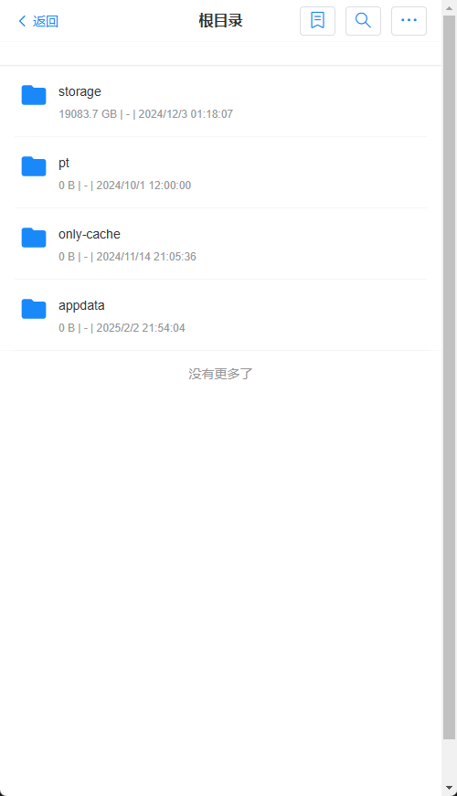
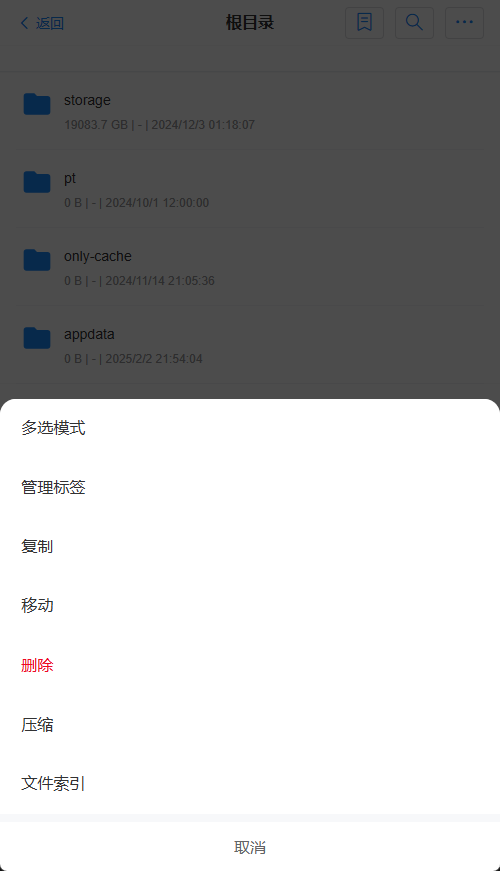
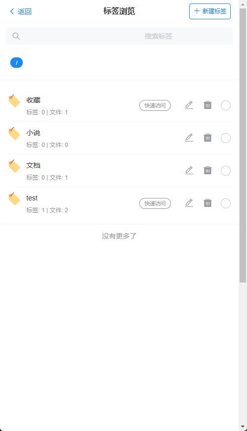
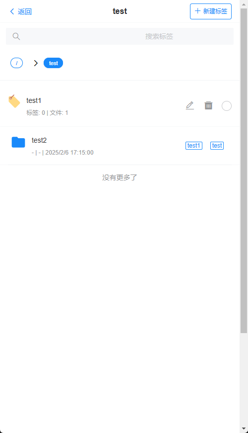
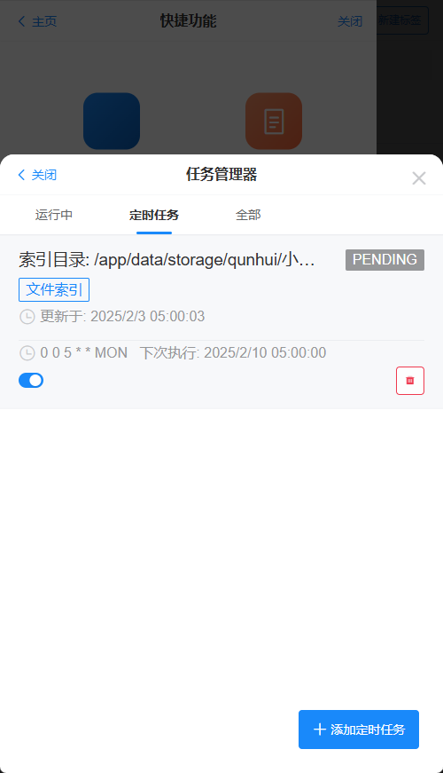
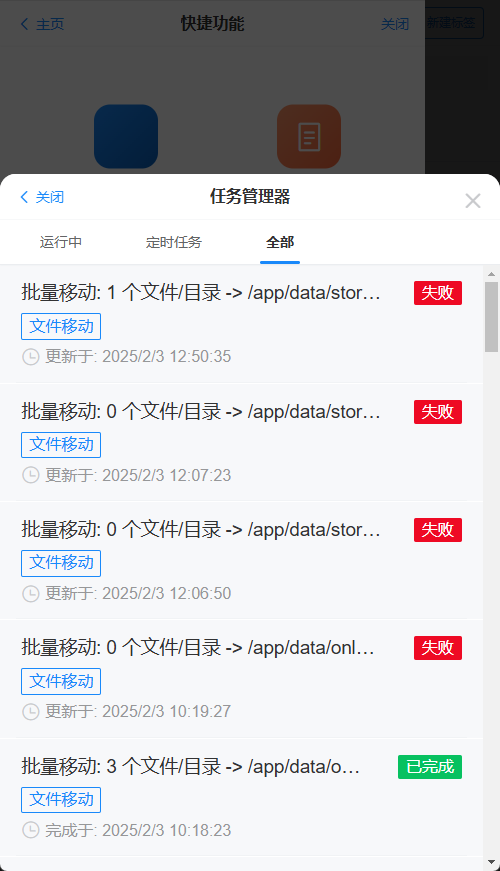
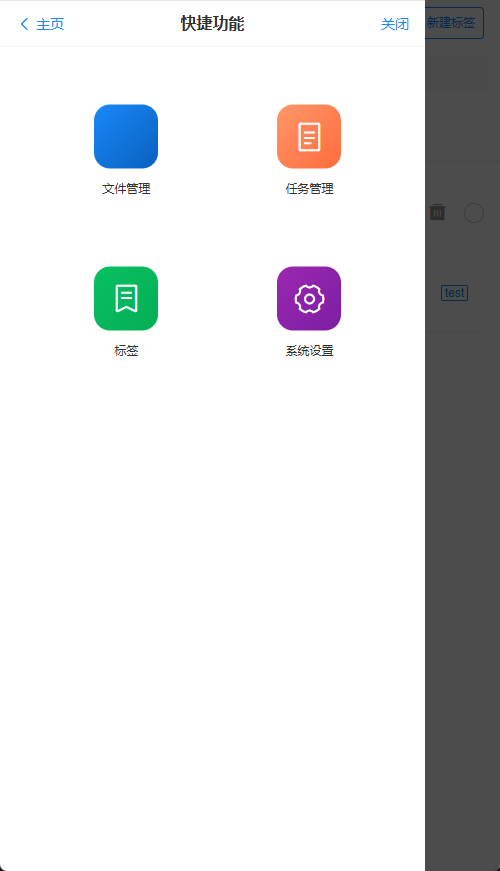

# FileFlexManager

Web 文件管理器，主要是方便管理nas上的文件，我有一台nas，找了很多文件管理软件，都不太满意，所以就自己写了一个，目标是就像在windows里管理文件一样方便的在手机上管理nas上的文件

## 核心功能特点

- 📱 移动端优先的响应式设计
  - 专为手机使用场景优化
  - 全局活动抽屉，方便快速跳转,任意界面右滑滑出
  - 注：电脑端需调整浏览器窗口至手机尺寸以获得最佳体验
- 🏷️ 文件标签系统
  - 支持标签绑定文件内容
  - 相同内容文件自动关联标签
  - 基于标签快速浏览搜索文件
- 🔍 支持文件索引，快速搜索
- 🎯 任务管理系统
  - 文件操作任务化（复制、移动等绝大部分重文件操作）
  - 实时进度跟踪
  - 特别适合NAS大文件操作管理
- 📦 强大的文件处理功能
  - 当前支持常用文件功能，如解压缩、压缩、删除、复制、移动、上传、下载等
  - 未来支持通过插件扩展（Python、Shell）文件处理功能

## 示例
1. 首页


2. 文件管理
- 文件列表

- 文件操作


3. 标签



4. 任务管理



5. 全局活动抽屉，方便快速跳转,任意界面右滑滑出


## 使用教程

当前只建议通过docker 安装
```
docker pull huanzhen7777/fileflexmanager:latest

docker run -d \
  --name FileFlexManager \
  -p 8080:8080 \
  -v "$(pwd)/docker/config:/app/config" \
  -v "$(pwd)/docker/data:/app/data" \
  -e SERVER_PORT=8080 \
  -e USER_ID=1000 \
  -e GROUP_ID=1000 \
  --restart unless-stopped \
  fileflexmanager:latest
```

- /app/data 为文件管理根目录
- /app/config 为配置目录
- USER_ID GROUP_ID 为 uid gid 默认为1000 1000


## 未来规划
- [ ] 支持扩展插件，支持python、shell来增强处理文件
- [ ] 支持文件分享
- [ ] 支持挂载webdav、smb、ftp 文件以集中管理文件
- [ ] 支持app端


## 技术架构

### 后端技术栈
- ✨ JDK 21
- 🚀 Spring Boot 3
- 📦 Gradle 
- 💾 MyBatis Plus
- MapStruct
- 🗄️ H2 数据库
- 🏗️ DDD 架构设计
- 🐳 Docker 部署
- 🧪 JUnit 5 测试框架

### 前端技术栈
- 🎯 Vue 3 + TypeScript
- 📱 Vant UI 组件库
- 🎨 移动端优先设计
